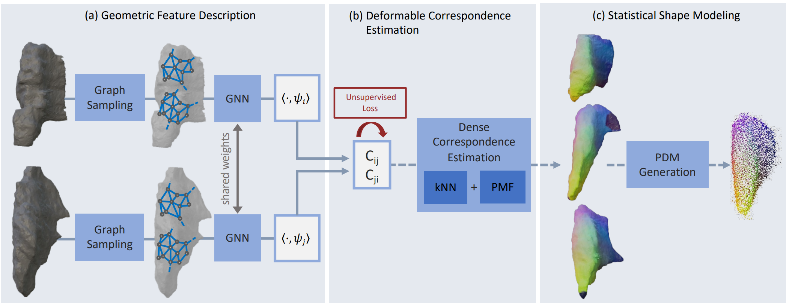
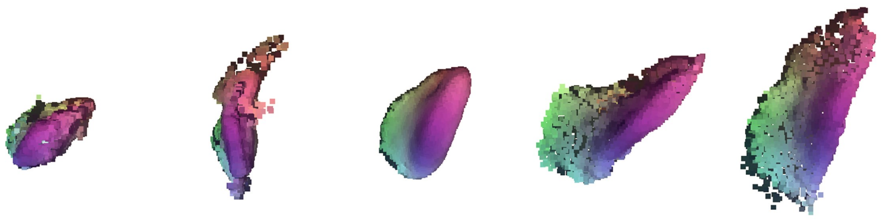

## S3M [[Paper]](https://arxiv.org/abs/2304.07515)

**S3M: Scalable Statistical Shape Modeling through Unsupervised Correspondences**<br>
Lennart Bastian*, Alexander Baumann*, Emily Hoppe, Vincent Bürgin, Ha Young Kim, Mahdi Saleh, Benjamin Busam, Nassir Navab<br>
In MICCAI, 2023.


---
Our proposed method for unsupervised shape model curation. 
(a) We use a Siamese Graph Neural Network as shape descriptor and project the extracted features onto the Laplace-Beltrami eigenfunctions $\psi$ to obtain spectral representations.
(b) From these, we optimize a functional mapping between pairs of shapes with an unsupervised loss. 
Gradients are backpropagated to the geometric descriptors.
(c) During inference, the dense correspondences are estimated 
between pairs of shapes 
based on the learned population parameters, which are then used to construct a statistical shape model.

### Install
This implementation uses Python 3.8, PyTorch 2.0 and Cuda 11.8. We recommend to use [conda](https://docs.conda.io/en/latest/miniconda.html) to deploy the environment.
  * Create environment with conda:
  ```
  conda create -n s3m python=3.8
  conda activate s3m
  ```
  * Install the basic framework (Cuda, PyTorch, NumPy):
  ```
  conda install -c "nvidia/label/cuda-11.8.0" cuda-toolkit
  export PATH=~/miniconda3/envs/s3m/bin:{$PATH}
  export LD_LIBRARY_PATH=~/miniconda3/envs/s3m/lib:${LD_LIBRARY_PATH}
  pip install numpy==1.23.5
  pip install -i https://download.pytorch.org/whl/cu118 torch==2.0.0 
  ```
  * Install the other packages:
  ```
  pip install -r requirements.txt
  ```

### Data Structure
The model requires meshes as input data whose format is readable by trimesh (e.g. .ply).
The files must be enumerated in the following way:<br>    
```
data
   |-- 001.ply
   |-- 002.ply
   |-- 003.ply
   ...
```
### Configuration File
Under [config/config.yml](config/config.yml) you can find the configuration file, in which you can define your paths and parameter settings.
```
SEED: 42                                              # Random seed
data:
  data_folds: <list of folds>                         # List of folds, e.g. [[0,1], [2,3], [4,5]]
  val_fold: 0                                         # Validation fold, e.g. 0 means fold [0,1] is the validation fold
  data_path: <path to mesh files>                     # Path to mesh files
  output_path: <path to output directory>             # Path to output directory
ssm:
  feat_size: 352                                      # Descriptor dimension of Graph Neural Network
  n_points: 4000                                      # Number of points to which the meshes are downsampled during the preprocessing of training
  n_points_inference: 2048                            # Number of points to which the meshes are downsampled during the preprocessing of inference
  n_jobs: 1                                           # Number of jobs in multiprocessing
  n_lbo_eigenfunctions: 20                            # Number of used eigenfunctions of Laplace-Beltrami-Operator
  scaling: null                                       # Scaling vector for unit conversion, e.g. [0.12,0.12,0.12] for our thyroid dataset
  weights: null                                       # Pretrained weights of the GNN
  TrainingDetails:
    batch_size: 64                                    # Batch size during training
    lr: 0.0001                                        # Learning Rate
    n_epochs: 30                                      # Number of training epochs
    n_sample_points: 2048                             # Number of points to which the meshes are downsampled in each training iteration  
  TestingDetails:
    reference_shape: null                             # Number of reference shape during inference
    variance_pmf:  1000                               # Variance of Gaussian Kernel in PMF postprocessing
```

### Run the pipeline
After having set the configurations, you can run the model's pipeline by: 
```
python run_s3m.py config/config.yml
```
The script automatically iterates over all folds as validation folds.
The results are saved in a new folder in the output directory from the config file. The folder has the following structure:
```
experiment_<run key of 8 chars>_<stem of data_path>
  |-- s3m_run.log
  |-- fold_0
        |-- mat
            |-- out_<reference_number>_000.mat
            |-- out_<reference_number>_001.mat
            |-- out_<reference_number>_002.mat
            ...
        |-- <tensorboard file>
        |-- corres_verts.npy
        |-- config.yml
   ...
```
The mat folder consists of the mat files with correspondences between the reference shape and the other shapes. After loading such a file with scipy, you obtain a dictionary where the final correspondences are found under the key "y2x_pmf".<br>
Furthermore, the corres_verts.npy file consists of the vertices of all shapes corresponded by the obtained predictions. This file is also used for further evaluation.
### Evaluation
To evaluate the model on your dataset according to generalization and specificty, you need to run:
```
python run_evaluation.py <output_path>/experiment_<run key of 8 chars>_<stem of data_path>
```
The code automatically evaluates each validation fold and prints the results in the end.

With the defined [Statistical Shape Model class](evaluation/SSM.py) you can obtain the mean shape and eigenshapes as below.

---


---


### Citation
If you find our work helpful, please consider citing
```
@article{bastian2023s3m,
  title={S3m: Scalable statistical shape modeling through unsupervised correspondences},
  author={Bastian, Lennart and Baumann, Alexander and Hoppe, Emily and B{\"u}rgin, Vincent and Kim, Ha Young and Saleh, Mahdi and Busam, Benjamin and Navab, Nassir},
  journal={arXiv preprint arXiv:2304.07515},
  year={2023}
}
```
---


